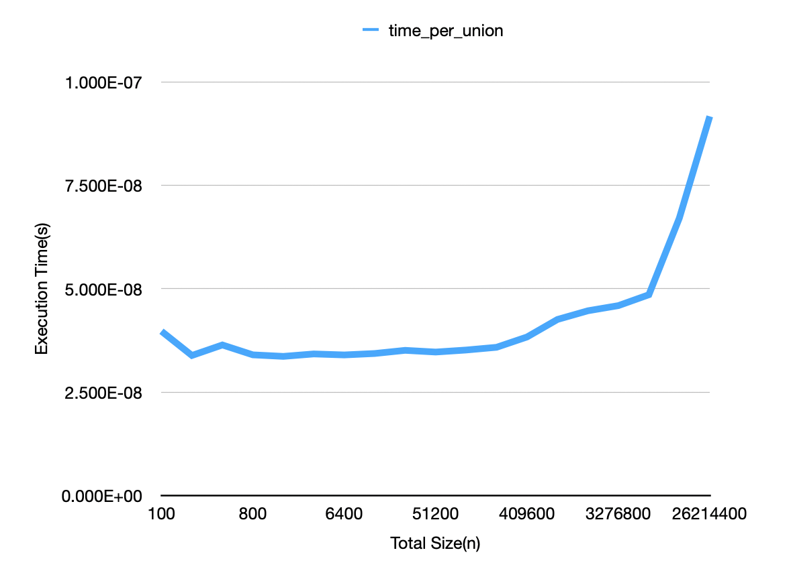
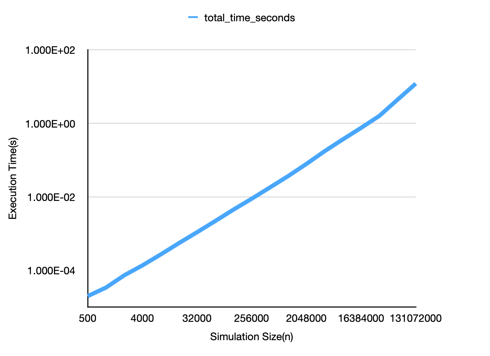
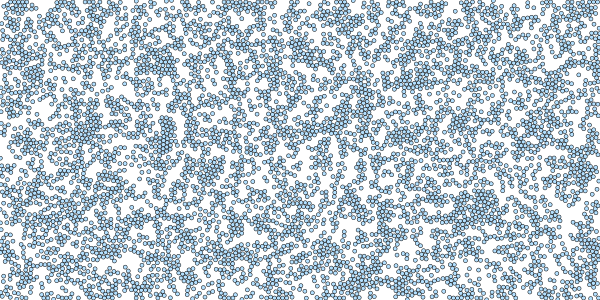
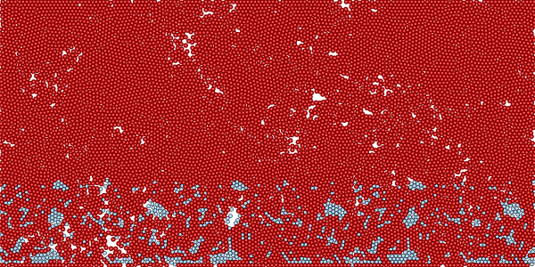
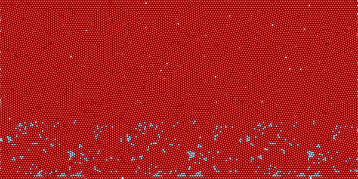

# Technical Report: Disjoint Set Union (DSU) for Particle Jamming Analysis

**Name:** Shao-Yu, Huang  
**Topic:** Disjoint Set Union with Path Compression and Union by Size in 
Granular Media

---

## 1. Introduction
### 1.1 Overview of the Data Structure
The Disjoint Set Union (DSU), commonly referred to as Union-Find, is an 
efficient data structure designed to manage the partitioning of a set into 
disjoint, non-overlapping subsets. It primarily facilitates two fundamental 
operations:
1. **Find**: Identifies the specific subset containing a given element, 
   typically by returning a representative member.
2. **Union**: Merges two distinct subsets into a single, unified set.

### 1.2 The Problem: Rigidity Percolation in Granular Media
Within the field of soft matter physics, identifying "force chains" in 
granular media—such as sand or soil—is critical for predicting structural 
failure or jamming transitions. This paper implements a DSU-based approach 
to analyze rigidity percolation: the threshold at which a collection of 
interacting particles forms a globally connected, rigid cluster that spans 
the system boundaries.

### 1.3 Brief History
The DSU was first described by Bernard A. Galler and Michael J. Fischer in 1964.
While the basic concept is intuitive, the highly optimized version 
using **Path Compression** and **Union by Rank/Size**—which results in 
nearly constant time complexity—was rigorously analyzed by Robert Tarjan in 
1975 using the inverse Ackermann function.

### 1.4 Report Roadmap
This report evaluates the theoretical efficiency of the DSU, provides an 
empirical analysis of its performance within a quasi-2D physics simulation, 
and details the specific C++ implementation strategies employed.

---

## 2. Analysis of the Data Structure
### 2.1 Theoretical Complexity
#### 2.1.1 Core Concepts

* **Path Compression:** A technique where every node visited during a `find` 
  operation is attached directly to the root, shortening future paths.
  For example, if the parent array = [1, 1, 1, 3, 3]. If we unite the 
  clusters by linking root `3` to root `1`. the array becomes [1, 1, 1, 1, 3]
  . Path compression does not waste time updating particle 4 instantly. 
  However, the very next time we call `find(4)`, the algorithm traverses the 
  path `4 -> 3 -> 1`, updates particle `4` to point directly to `1`. The 
  array becomes [1, 1, 1, 1, 1]. This dynamic flattening ensures subsequent 
  find operations operate in $O(1)$ time.

* **Union-by-Size:** A rule where the tree with the smaller numbers of nodes
  (Size) is attached to the root of the tree with the larger number of nodes.
  This ensures the maximum tree height remains logarithmic, while 
  conveniently allowing us to track the size of the largest force chain in 
  the granular system.

  
To intuitively understand why these two optimizations (Path Compression and 
Weighted Union) are absolutely crucial, let's use a **"Corporate 
Hierarchy"** analogy.

Suppose you have an organization with 8 employees (nodes 1 through 8), and 
initially, everyone is their own independent boss.

##### I. No Optimizations (The Worst Case)
If you always merge departments blindly—for example: employee 2 reports to 1,
3 reports to 2, 4 reports to 3, and so on—you end up with a highly 
inefficient, **long chain of command**:
`8 -> 7 -> 6 -> 5 -> 4 -> 3 -> 2 -> 1`

* **Finding the ultimate boss of 8 (the root):** You have to make 7 
  sequential jumps.
* **The Cost:** Without Path Compression, the next time you search for 8, 
  you *still* have to make 7 jumps. If you query $m$ times, the total cost 
  scales linearly with both $m$ and $n$, resulting in an $O(mn)$ time 
  complexity (represented as the upper bound $k_2mn$ in Tarjan's paper).

##### II. Only Using "Path Compression" (The Collapsing Rule)
Taking that same long chain as example. However, this time, after execute a 
single `FIND(8)`, magic happens.

* **First `FIND(8)`:** You still jump 7 times to reach the big boss, 1.
* **Compression Occurs:** The algorithm takes everyone it met on that path 
  (8, 7, 6, 5, 4, 3, 2) and **promotes them to report directly to 1**.
* **Structural Change:** The once-deep, inefficient chain instantly 
  collapses into a "star-shaped" (flat) structure.
* **Subsequent Queries:** The next time you search for 8, 7, or 5, it only 
  takes **1 step**.

This "self-healing" property is why Path Compression alone drops the 
complexity significantly. The more you query, the flatter the tree becomes.

##### III. Why Path Compression Alone Isn't Enough (The Malicious Sequence)
If you encounter a "malicious" sequence of operations, the efficiency of 
Path Compression is neutralized, because you never give it the chance to do 
a massive collapse.

Imagine the same chain `8 -> 7 -> 6 -> 5 -> 4 -> 3 -> 2 -> 1`, but you query 
in this specific, bottom-up order:
**`FIND(2), FIND(3), FIND(4) ... FIND(8)`**

* **`FIND(2)`:** Path is `2 -> 1`. No real compression happens.
* **`FIND(3)`:** Path is `3 -> 2 -> 1`. 3 is now attached directly to 1.
* **`FIND(4)`:** Path is `4 -> 3 -> 1`. 4 is now attached directly to 1.
* **The Flaw:** Each step only compresses *one* new node at a time. The 
  total jumps amount to $1 + 2 + 3 + 4 + 5 + 6 + 7 = 28$ jumps.

Because of this vulnerability, Tarjan proved the upper bound is dictated by 
the complex formula:
$$t(m, n) \leq k \cdot m \cdot \max(1, \frac{\log(n^2/m)}{\log(2m/n)})$$
It essentially means: **If you don't query enough (a small $m$), or if you 
query in the worst possible order, Path Compression doesn't have the runway 
to flatten the tree efficiently, and the performance gets stuck near $O(n 
\log n)$ or worse.**

##### IV. Combining Both: The Inverse Ackermann Miracle
To fix this vulnerability, we introduce the **"Weighted Union Rule"** (or 
Union by Rank). The combination of these two rules creates a chemical 
reaction that results in one of the most fascinating time complexities in 
computer science.

Here is why they work so perfectly together:
* **The Physical Constraint (Weighted Union):** By always attaching smaller 
  trees under larger ones, you guarantee the tree depth **never** exceeds 
  $\log n$. More importantly, it ensures a strict physical rule: 
  *High-ranking nodes become exponentially rare.* (e.g., A node of rank $r$ 
  must have at least $2^r$ descendants).

* **The Forced Upward Jumps (Path Compression):** When nodes are compressed, they are forced to jump to higher-ranking ancestors.
* **The Mathematical Magic:** To analyze this, Tarjan placed imaginary 
  "checklines" across the tree's height. Because high-ranking nodes are 
  exponentially rare, he could space these checklines exponentially further 
  apart (creating an "Ackermann function" gap).
  $$Total(Jumps) \approx \frac{n}{2^A} \times Gap$$
  The penalty of having to jump across these massively growing gaps is **perfectly cancelled out** by the fact that there are exponentially fewer nodes that will ever reach those heights!


Because this mathematical scale balances out perfectly at the extreme growth rate of the Ackermann function, the amortized cost per operation drops to the near-miraculous **Inverse Ackermann function, $\alpha(m, n)$**—a number so small that for any physically possible input in the universe, it is virtually indistinguishable from a constant $O(1)$ time.

##### V. The Ackermann Function
The Ackermann function $A(i, j)$ represents a hierarchy of hyperoperations 
(addition, multiplication, exponentiation, tetration, etc.). Its inverse, 
$\alpha(n)$, grows incredibly slowly—remaining $\leq 5$ for any value 
representing physical quantities in the universe.

$$A(i, j) =
\begin{cases}
2j & \text{for } i = 0 \\
0 & \text{for } i \ge 1, j = 0 \\
2 & \text{for } i \ge 1, j = 1 \\
A(i - 1, A(i, j - 1)) & \text{for } i \ge 1, j \ge 2
\end{cases}$$

##### VI. The Inverse Ackermann Function
$$\alpha(m, n) = \min \left\{ z \ge 1 \mid A\left(z, 4 \left\lceil \frac{m}{n} \right\rceil \right) > \log_2 n \right\}$$
* $m$: The total number of FIND operations.
* $n$: The total number of elements in the Disjoint Set (and the maximum 
  number of UNION operations).
* $z$: The "weight" or "level" of the Ackermann function (how many times we 
  have to nest the hyperoperations).
* $\lceil m/n \rceil$: This is the average number of FIND queries per node.

This time complexity was empirically tested using `dsu_unite_benchmark.cpp`.
The script generates a Disjoint Set of size $N$ and performs a series of `unite`
operations. It then calculates both the total execution time and the average 
time required per `unite` execution to verify the theoretical $O(1)$ 
amortized cost.



As observed in the graph, the average time per `unite` operation remains 
effectively constant for the majority of the test, perfectly demonstrating 
the $O(\alpha(m,n))$ complexity of the inverse Ackermann function. The slight 
growth in execution time at the tail end of the graph is a hardware artifact 
rather than an algorithmic breakdown. Specifically, it is caused by CPU cache 
capacity misses. Once the underlying arrays grow too large to fit entirely 
within the CPU's L1–L3 cache hierarchy, the processor is forced to fetch 
data directly from main memory (RAM), introducing noticeable memory latency 
overhead.



As demonstrated in the log-log plot above, the total execution time for the 
`unite` operations scales linearly, $O(n)$. This is built upon the 
foundation of our optimized DSU: because a single `unite` operation has an 
amortized constant time complexity of $O(\alpha(m,n)) \approx O(1)$ , 
performing this operation across the entire system of $n$ particles yields a 
strictly linear total time complexity. The graph's straight trajectory 
confirms that the algorithm successfully avoids the exponential slowdowns 
common in naive physics simulations.

### 2.2 Space Complexity
The space complexity is strictly linear:
$$O(n)$$
where $n$ is the number of elements (particles). This is due to the 
requirement of two auxiliary arrays: `parent` and `size`.

---

## 3. Empirical Analysis
### 3.1 Experimental Design
The implementation was evaluated using a quasi-2D simulation environment 
under Periodic Boundary Conditions (PBCs). Our analysis characterizes the 
jamming transition by systematically varying the packing fraction ($\phi$), 
allowing for the identification of the critical threshold where rigid 
clusters emerge.

### 3.2 Data Observations
Experiments were conducted within a rectangular simulation box under hybrid 
boundary conditions. The system is constrained by hard walls at the top and 
bottom, which the particles cannot penetrate. In the horizontal direction, 
Periodic Boundary Conditions (PBCs) are applied; particles exiting the right 
boundary re-enter from the left, effectively simulating an infinitely 
repeating horizontal domain.

* **Dilute State ($\phi = 0.40$):** Max cluster size remained low (< 5% of 
  $n$). No spanning cluster detected.

  
* **Transition State ($\phi = 0.74$):** Large clusters began to form. DSU 
  detected a spanning cluster (Jammed). 0.74 is the packing fraction of 
  Hexagonal Packing, which is the most dense packing without overlapping.

  
* **High Density ($\phi = 0.834$):** This is the dense state mentioned in
  Chapter 3 of this reference [^1].

  


---

## 4. Application: Computational Physics
In granular materials, stress is not distributed uniformly; it travels along 
"force chains." By using the DSU, researchers can:
1.  Quantify the number of independent clusters in a system.
2.  Identify the "Strong Network" versus "Weak Network."
3.  Detect the exact moment of percolation (jamming) in real-time simulations.

The DSU is preferred over standard Graph Traversal (BFS/DFS) because it 
handles **dynamic edges** (contacts forming and breaking) much more 
efficiently without re-scanning the entire graph.

---

## 5. Implementation
### 5.1 Environment and Tools
* **Language:** C++20
* **Memory Management:** Manual Heap Allocation (`new`/`delete`) for 
  performance and large-scale scalability.
* **Testing:** Custom unit test suite using the `assert` library.

### 5.2 Implementation Challenges
A significant challenge involved the integration of **Periodic Boundary 
Conditions (PBC)**. Particles wrapping around the horizontal axis ($x$) 
required the DSU to maintain logical connectivity even when the spatial 
distance between coordinates appeared large. This was solved by abstracting 
the distance calculation within a `SimulationBox` class.

```c++
double SimulationBox::get_periodic_dx(double x1, double x2) const {
    double dx = x1 - x2;
    // Circulation logic: if distance is more than half the width, 
    // it's shorter to go the "other way" around the circle.
    if (dx > width * 0.5) dx -= width;
    if (dx < -width * 0.5) dx += width;
    return dx;
}

double SimulationBox::get_distance(const Particle& p1, const Particle& p2) const {
    double dx = get_periodic_dx(p1.get_x(), p2.get_x());
    double dy = p1.get_y() - p2.get_y();
    return std::sqrt(dx * dx + dy * dy);
}
```

### 5.3 Code Discussion: The Core Union
The union function in the DisjointSet class takes two particle indices, p and q.
It uses these indices to find the root of each particle to determine whether 
they belong to the same disjoint set. If they are not in the same set, it 
attaches the smaller set to the larger set.

```cpp
void DisjointSet::unite(int p, int q) {
    // Safety check
    if (p < 0 || p >= num_elements || q < 0 || q >= num_elements) {
        throw std::invalid_argument("Particle indices out of bounds.");
    }

    // Find the roots
    int root_p = find(p);
    int root_q = find(q);

    // Already in the same cluster
    if (root_p == root_q) {
        return;
    }

    // Since they are different clusters merging, the total number of clusters drops by 1
    num_clusters--;

    // 3 & 4. Union by Size and updating trackers
    if ((*size)[root_p] < (*size)[root_q]) {
        // root_p is smaller. Attach it to root_q.
        (*parent)[root_p] = root_q;
        (*size)[root_q] += (*size)[root_p];
        // Update max size
        if ((*size)[root_q] > max_cluster_size) {
            max_cluster_size = (*size)[root_q];
        }

    } else {
        // root_q is smaller (or they are equal). Attach it to root_p.
        (*parent)[root_q] = root_p;
        (*size)[root_p] += (*size)[root_q];
        // Update max size
        if ((*size)[root_p] > max_cluster_size) {
            max_cluster_size = (*size)[root_p];
        }
    }
}
```

The key part is the find function. This function not only finds the root of 
a particle in the set, but also updates the path by modifying the parent vector.
Although this may seem expensive during the first call, it compresses the 
path by linking all particles in the set directly to the root. As a result, 
subsequent find operations run in nearly $O(1)$ time.

```c++
int DisjointSet::find(int p) {
    // Safety check
    if (p < 0 || p >= num_elements) {
        throw std::invalid_argument("index of particles must be positive and "
                                    "smaller than number of particles");
    }

    // Find the root and update the path
    if ((*parent)[p] == p) {
        return p;
    }

    (*parent)[p] = find((*parent)[p]);
    return (*parent)[p];
}
```

## 6. Summary

In granular physics, both numerical and physical experiments are commonly 
conducted. Beyond my simple model that only relaxes particles, physicists 
often apply shear forces at the boundaries. As a result, the experimental 
data typically takes the form of a video, containing information for a large 
number of particles across many frames. If traditional graph analysis 
methods are used, the analysis can become very time-consuming due to the 
large volume of particle data and frames. The implementation and analysis of 
the **Disjoint Set Union (DSU)** data structure demonstrate that complex 
connectivity problems in large-scale systems can be solved with near-linear 
efficiency. By integrating **Path Compression** and **Union by Size**, the 
algorithm maintains high performance even as the number of particles ($n$) 
and contact interactions increases, making it a superior choice over 
standard graph traversal methods for dynamic systems.

### 6.1 Key Learning Outcomes
Through this project, I gained several technical insights:
* **Algorithm Synergy:** I learned how two relatively simple 
  optimizations—Path Compression and Union by Size—combine to create an 
  extraordinarily efficient time complexity of $O(\alpha(m,n))$.
* **Domain Integration:** The project highlighted the importance of adapting 
  general-purpose data structures to domain-specific constraints, such as 
  implementing **Periodic Boundary Conditions** for physics simulations.
* **Memory Management:** Moving the simulation to **Heap Memory** was a 
  critical step in handling high-density packing fractions ($\phi = 0.85$) 
  without encountering stack overflow errors, a common hurdle in scientific 
  computing.

Ultimately, the DSU proved to be an indispensable tool for analyzing the 
transition from a fluid-like state to a rigid solid in granular matter, 
providing a data-driven method for detecting the exact moment of rigidity 
percolation.

---

## 7. References

[^1]: Papadopoulos, L., Porter, M. A., Daniels, K. E., & Bassett, D. S. (2018).
Network analysis of particles and grains. Journal of Complex Networks, 6(4), 
485–565. https://doi.org/10.1093/comnet/cny005

[^2]: -is-this-fft-., (2022, January 23). [Tutorial] Proving the inverse 
Ackermann complexity of Union-Find. Codeforces. 
https://codeforces.com/blog/entry/98275

[^3]: Daniels, K. E., Kollmer, J. E., & Puckett, J. G. (2017). Photoelastic 
force measurements in granular materials. Review of Scientific Instruments, 
88(5), 051808. https://doi.org/10.1063/1.4983049

[^4]: Tarjan, R. E. (1975). Efficiency of a good but not linear set union 
algorithm. Journal of the ACM, 22(2), 215–225.
https://doi.org/10.1145/321879.321884